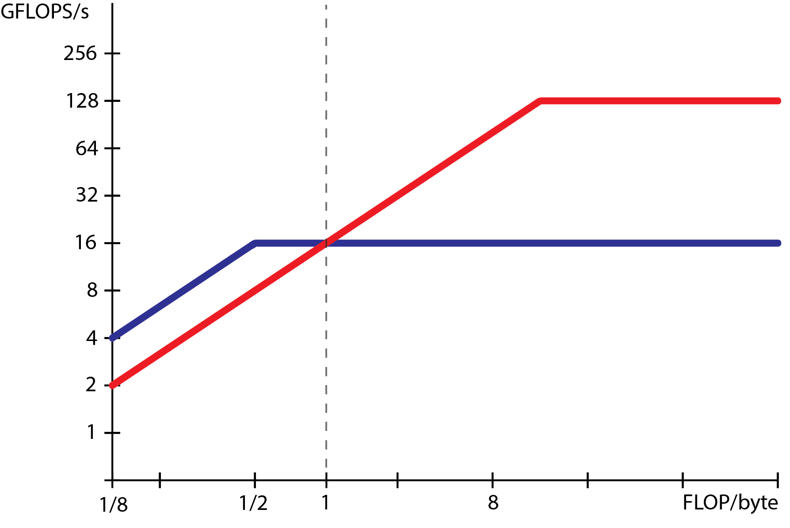

# Problem 5

We want to benchmark two multicores using the roofline model.

Multicore **M1** has a peak floating-point performance (peak-FP perf.) of 128 GFLOP/s from Arithmetic Intensity (AI) AI=8 FLOP/byte (and above). Its FP performance at AI=1/8 FLOP/byte is 2 GFLOP/s.

Multicore **M2** has a peak-FP performance of 16 GFLOP/s from AI=1/2 FLOP/byte (and above), and its performance at AI=1/8 FLOP/byte is 4 GFLOP/s.

#### a) Draw the roofline model for multicore M1.
#### b) Draw the roofline model for multicore M2.

#### c) Explain what happens when running a benchmark with AI=1 FLOP/byte on the two multicores. Which multicore does perform the best?

Both multicores perform the same (16 GFLOP/s) at AI=1 FLOP/byte. M1 is “memory bound” while M2 is “computation bound”.