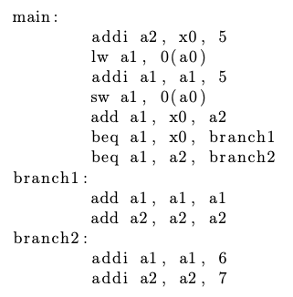

# Problem 1

Answer the following questions.

## Question 1.1

How long are RISC-V instructions?

Answer:

    32-bit.

## Question 1.2

What is forwarding good for?

Answer:

    Minimizing data hazards in the pipeline

## Question 1.3

Which of the following is true?

1. Register fields are always in the same position in the instruction to simplify pipelining.
2. RISC-V can add two numbers that are in memory in a single instruction.
3. A single-cycle datapath is the best performing implementation of RISC-V.

Answer:

   (1) must be the correct answer.

## Question 1.4

Why do caches work?

Answer:

   They work because the data you move data closer to the process and thereby bringing down the cost of load data. 

## Question 1.5

Which of the following is true?

1. Fully associative caches are the caches with the simplest implementation.
2. An instruction set simulator of RISC-V can boot Linux.
3. Pipelining improves latency of instructions compared to non-pipelining implementations.

Answer:

   (2) 

# Problem 2

Consider the following RISC-V processors:

**P1**: single cycle processor (each instruction is executed in one clock cycle) with T_clock = 10 ns.

**P2**: 5-stage pipelined processor (stages: F, D, E, M, W) without data-forwarding, with T_clock = 2 ns.
Branches are assumed not-taken and the decision on taking the branch is made at the end of stage D.

**P3**: as P2, but with data-forwarding implemented.

The processors are used to execute the following fragment of RISC-V code.

## Question 2.1

For each processor, show the timing diagram (instructions executed in each clock cycle) of the execution of the above fragment of RISC-V code.

## Question 2.2

For each processor, compute the execution time of the fragment of RISC-V code.

## Question 2.3

What is the speed-up of **P3** over **P1** and **P2**?

# Problem 4

Consider the following caches. For both, assume 4KB size, 32-bit addresses, and byte ad- dressing:

**C1**: direct mapped with 8 word blocks and write-through policy.
**C2**: 4-way set associative with 4 word blocks, LRU replacement, and write-back policy.

For each cache:

## Question 4.1

Show how binary addresses are divided into tag, index, block offset, and byte offset.

* memory size = 4KB size = 4096 = 2^12 
* 32-bit addresses
* byte addressing

### C1
**Byte offset** look at the addresses size

Byte offset = log_2(4) = 2 bits (4 bytes / 32 bit words)
Block offset = = log_2(8) = 3 bits (8 word blocks)
Block count = 2^12/2^3/2^2 = 2^7 = 128 blocks      # giver dermed også index
Index = 7 bits
Tag = 32 − 7 − 3 − 2 = 20 bits

### C2

Byte offset = log_2(4) = 2 bits (4 bytes / 32 bit words)
Block offset = = log_2(4) = 2 bits (4 word blocks)
Block count = 2^12/2^2/2^2/2^2 = 2^6 = 64 sets      # giver dermed også index, (2^2 = 4 (4-way))
Index = 6 bits
Tag = 32 − 7 − 2 − 2 = 22 bits

## Question 4.2

Calculate the total number of bits required for the caches.

### C1

Overhead = 128 blocks * (20 tag + 1 valid) = 2688 bits
Total = 4KB * 8 + Overhead = 4096 * 8 + 2688 = 35456 bits

### C2

note : 2^2 blocks = 4 (way)

Because the write-back policy is used, a dirty bit is needed to keep track changes.

Overhead =  64 sets * 2^2 blocks * (22 tag + 1 valid + 1 dirty) = 6144 bits
Total = 4KB * 8 + Overhead = 4096 * 8 + 6208 = 38912 bits