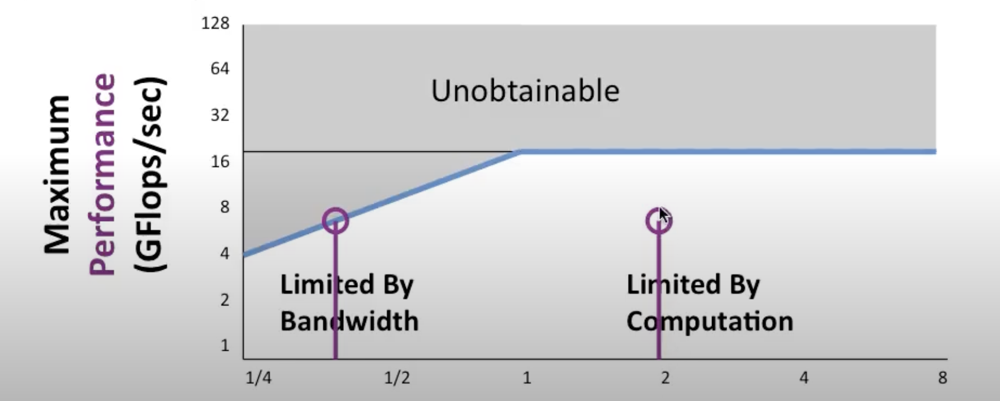
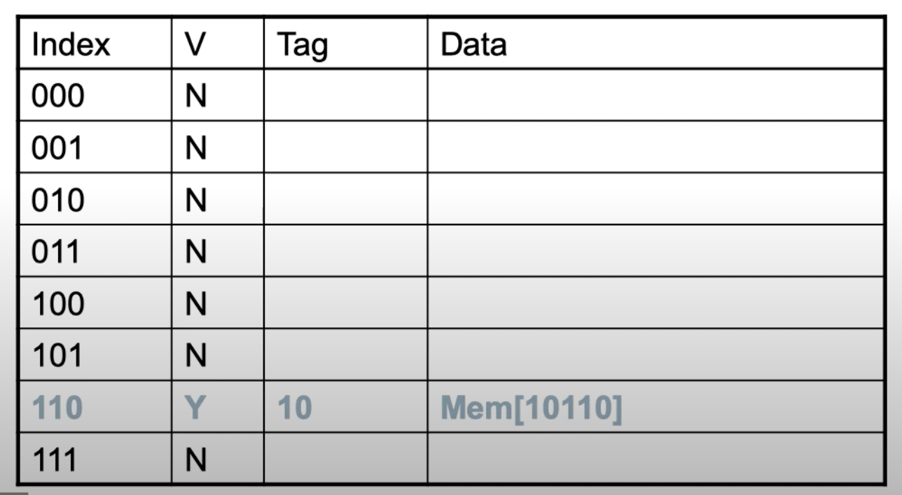
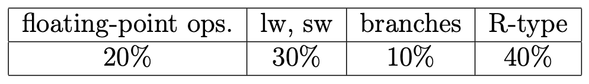
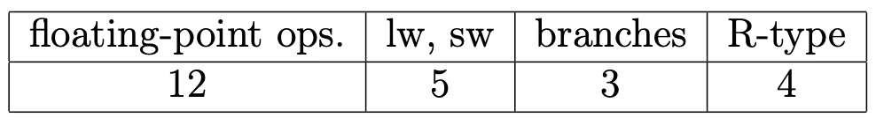

# Problem 1

## Question 1.1

Why does RISC-V have a signed and an unsigned version of load byte, but only one version for store byte?

Answer:

As the byte gets loaded into a 32(64) bit register it needs to be interpreted unsigned or signed to determine the upper bits (0 or sign extended). A store byte writes that byte into a single byte in memory and needs no upper bits handling.

## Question 1.2

When does a page fault occur?

Answer:

When a page is not in main memory and it has to be retrieved from the disk.

## Question 1.3

What is the use of the Translation Look-aside Buffer (TLB)?

Answer:

A cache for fast translation from virtual to physical address.

## Question 1.4

In this “roofline" diagram for two Opteron processors X2 and X4, explain what happens for X2 and X4 when running a kernel with arithmetic intensity 2.0.
What modifications can be done to improve the performance of X4?

Note: 

Answer:

At AI=2.0, X2 is computation bound, while X4 is memory bound. We can increase the memory bandwidth of X4.

# Problem 2

Consider the following RISC-V processors:

**P1**: 5-stage pipelined processor (stages: F, D, E, M, W) without data-forwarding, with f_clock = 1 GHz. Branches are assumed not-taken and the decision on taking the branch is made at the end of stage D.
**P2**: as P1, but with data-forwarding implemented and branch prediction hardware (placed in stage F).

The processors are used to execute the following fragment of RISC-V code. At the time of execution, the value in register x20 = 16 (decimal), and the branch has been already taken several times.

## Question 2.1
 
a) Show the timing diagram (instructions executed in each clock cycle) for the execution on processor P1 of the above fragment of RISC-V code. Stop when you fetch instruction xor ....

   |       |                   | 1 | 2 | 3 | 4 | 5 | 6 | 7 | 8 | 9 | 10 | 11 | 12 | 13 | 14 | 15 | 16 | 17 | 18 | 19 | 20 | 21 | 22 | 23 |
   |-------|-------------------|---|---|---|---|---|---|---|---|---|----|----|----|----|----|----|----|----|----|----|----|----|----|----|
   | loop: |                   |   |   |   |   |   |   |   |   |   |    |    |    |    |    |    |    |    |    |    |    |    |    |    |
   |       | ld x31, 0(x20)    | F | D | E | M | W |   |   |   |   |    |    |    |    |    |    |    |    |    |    |    |    |    |    |
   |       | addi x20, x20, -8 |   | F | D | E | M | W |   |   |   |    |    |    |    |    |    |    |    |    |    |    |    |    |    |
   |       | add x31, x31, x21 |   |   | F | * | D | E | M | W |   |    |    |    |    |    |    |    |    |    |    |    |    |    |    |
   |       | sd x31, 8(x20)    |   |   |   |   | F | * | * | D | E |  M |  W |    |    |    |    |    |    |    |    |    |    |    |    |
   |       | bne x20, x0, loop |   |   |   |   |   |   |   | F | D |  E | M  |  W |    |    |    |    |    |    |    |    |    |    |    |
   |       | sub x23, x23, x24 |   |   |   |   |   |   |   |   | F |    |    |    |    |    |    |    |    |    |    |    |    |    |    |
   |       | xor …..           |   |   |   |   |   |   |   |   |   |    |    |    |    |    |    |    |    |    |    |    |    |    |    |
   | loop: |                   |   |   |   |   |   |   |   |   |   |    |    |    |    |    |    |    |    |    |    |    |    |    |    |
   |       | ld x31, 0(x20)    |   |   |   |   |   |   |   |   |   |  F |  D |  E |  M |  W |    |    |    |    |    |    |    |    |    |
   |       | addi x20, x20, -8 |   |   |   |   |   |   |   |   |   |    |  F |  D |  E |  M |  W |    |    |    |    |    |    |    |    |
   |       | add x31, x31, x21 |   |   |   |   |   |   |   |   |   |    |    |  F |  * |  D |  E |  M |  W |    |    |    |    |    |    |
   |       | sd x31, 8(x20)    |   |   |   |   |   |   |   |   |   |    |    |    |    |  F |  * |  * |  D |  E |  M |  W |    |    |    |
   |       | bne x20, x0, loop |   |   |   |   |   |   |   |   |   |    |    |    |    |    |    |    |  F |  D |  E | M  |  W |    |    |
   |       | sub x23, x23, x24 |   |   |   |   |   |   |   |   |   |    |    |    |    |    |    |    |    |  F |  D |  E | M  |  W |    |
   |       | xor …..           |   |   |   |   |   |   |   |   |   |    |    |    |    |    |    |    |    |    |  F |  D |  E | M  |  W |

b) Compute the corresponding execution time for P1.

# Problem 4

Consider the following caches. For all, assume 2KB size, 32-bit addresses, 32-bit words, and byte addressing:

**C1**: direct mapped with 2 word blocks.
**C2**: direct mapped with 4 word blocks.
**C3**: 2-way set associative with 2 word blocks and LRU replacement.

For each cache:

## Question 4.1

Show how binary addresses are divided into tag, index, block offset, and byte offset.

* memory size = 2KB size = 2048 = 2^11 
* 32-bit addresses
* 32-bit words
* byte addressing

### C1

**Byte offset** look at the addresses size

Byte offset = log_2(4) = 2 bits (4 bytes / 32 bit words)
Block offset = = log_2(2) = 1 bits (2 word blocks)
Block count = 2^11/2^2/2^1 = 2^8 = 256 blocks      # giver dermed også index
Index = 8 bits
Tag = 32 − 8 − 2 − 1 = 21 bits

### C2

Byte offset = log_2(4) = 2 bits (4 bytes / 32 bit words)
Block offset = = log_2(4) = 2 bits (4 word blocks)
Block count = 2^11/2^2/2^2 = 2^7 = 128 blocks      # giver dermed også index
Index = 7 bits
Tag = 32 − 7 − 2 − 2 = 21 bits

### C3

Byte offset = log_2(4) = 2 bits (4 bytes / 32 bit words)
Block offset = = log_2(2) = 1 bits (2 word blocks)
Blocks in set = 1 bits (2 blocks)                  # (2^1 = 2 (2-way))
Block count = 2^11/2^2/2^1/2^1 = 2^7 = 128 sets    # giver dermed også index, ekstra => (2^1 = 2 (2-way))
Index = 7 bits
Tag = 32 − 7 − 2 − 1 = 22 bits

## Question 4.2

Calculate the total number of bits required for the caches.

### C1

Overhead = 128 blocks * (21 tag + 1 valid) = 5632 bits
Total = 2KB * 8 + Overhead = 2048 * 8 + 5632 = 22016 bits

### C2

Overhead = 256 blocks * (21 tag + 1 valid) = 2816 bits
Total = 2KB * 8 + Overhead = 2048 * 8 + 2816 = 19200 bits

### C3
note : 2^1 blocks = 2 way

Overhead = 128 sets * 1 LRU + 2^7 sets * 2^1 blocks * (22 tag + 1 valid) = 6016 bits
Total = 2KB * 8 + Overhead = 2048 * 8 + 6016 = 22400 bits

## Question 4.3

### First convert all address to binary like:

binray adress

0
100
1000
1100
100000000000
1000
0
100000000000

### Then split it up according to the address subdivision in the table 

Remember: 

When doing direct mapped just do table like this:

Answer:

   |         |        |   C1  |        |          |   |        |   C2  |        |          |   |        |   C3  |        |          |
   |---------|--------|:-----:|:------:|----------|---|--------|:-----:|:------:|----------|---|--------|:-----:|:------:|----------|
   | Address |   Tag  | Index | Offset | Hit/Miss |   |   Tag  | Index | Offset | Hit/Miss |   |   Tag  | Index | Offset | Hit/Miss |
   |   000   |    0   |   0   |    0   |          |   |    0   |   0   |    0   |          |   |    0   |   0   |    0   |          |
   |   004   |    0   |   0   |   100  |          |   |    0   |   0   |   100  |          |   |    0   |   0   |   100  |          |
   |   008   |    0   |   1   |    0   |          |   |    0   |   0   |  1000  |          |   |    0   |   1   |    0   |          |
   |   00C   |    0   |   1   |   100  |          |   |    0   |   0   |  1100  |          |   |   10   |   1   |   100  |          |
   |    8    |    1   |   0   |    0   |          |   |    1   |   0   |    0   |          |   |    0   |   0   |    0   |          |
   |   008   |    0   |   1   |    0   |          |   |    0   |   0   |  1000  |          |   |    0   |   1   |    0   |          |
   |   000   |    0   |   0   |    0   |          |   |    0   |   0   |    0   |          |   |    0   |   0   |    0   |          |
   |    8    |    1   |   0   |    0   |          |   |    1   |   0   |    0   |          |   |   10   |   0   |    0   |          |
   |         | 21 bit | 8 bit | 3 bit  |          |   | 22 bit | 7 bit | 4 bit  |          |   | 22 bit | 7 bit | 3 bit  |          |

## Question 4.4

c1 = 3/8
c2 = 4/8
c3 = 5/8

# Problem 5

Consider a program executing 10^7 instructions with the following mix of operations:

A processor P1 requires the following number of cycles:

## Question 5.1

Determine the CPI for the benchmark program.

Answer:

CPI = (12 * 0.2 + 5 * 0.3 + 3 * 0.1 + 4 * 0.4) = 5.8

## Question 5.2

For a clock rate of 3 GHz, what is the CPU execution time?

Answer:

      period = 1 / 3 GHz = 1 / 3 * 10^9

      CPI * period * program = execution time in sec

5.8 * 1/(3*10^9) * 10^7 = 0.01933333333 s = 19.3 ms

**Additional information about the cache.**

Instruction miss rate is 5%. Data miss rate per cache access is 12%. Miss penalty for both data and instructions is 8 cycles.

## Question 5.3

Determine the execution time including memory stalls.

Answer:

      Miss CPI = (instructions percent) × (miss rate) × (miss penalty) 

Instruction miss CPI = 1.0 × 0.05 × 8 = 0.4 

lw, sw miss CPI = 0.3 × 0.12 × 8 = 0.288 ≃ 0.3

The sum of the Instruction miss rate and Data miss rate:

Excess CPI (due to misses) = 0.4 + 0.3 = 0.7

Ideal CPI (Q 5.1) = 5.8 

New CPI with stalls:

CPI (including cache misses) = 5.8 + 0.7 = 6.5

The time of the execution with stall is then calculated like:

Benchmark program = 10^7

t_exe = (6.5 × 10^7)/(3 × 10^9) = 2.16 × 10^−2 = 21.7 ms
