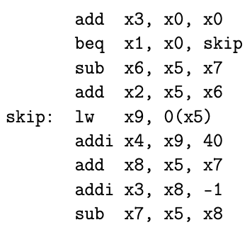

# Problem 2 

Consider the following processors

**P1** single cycle processor (each instruction is executed in one clock cycle)with T_clock = 5 ns.

**P2** 5-stage pipelined processor (stages: F, D, E, M, W) without data-forwarding with T_clock = 1 ns. Branches are assumed not-taken. In beq the decision on taking the branch is made at the end of stage D. The register file is written on the first half of the clock cycle and read on the second half.

**P3** As P2, but with data-forwarding implemented.
The processors are used to execute the following fragment of RISC-V code

### a) Assuming that at execution time the content of register x1 = 0 (branch is taken), for EACH processor

#### i. Show the timing diagram (instructions executed in each clock cycle) of the execution of the above fragment of RISC-V code.

##### P1

|       |                   | 1 | 2 | 3 | 4 | 5 | 6 | 7 |
|-------|-------------------|:-:|:-:|:-:|:-:|:-:|:-:|:-:|
|       | add    x3, x0, x0 | X |   |   |   |   |   |   |
|       | beq  x1, x0, skip |   | X |   |   |   |   |   |
|       | sub  x6, x5, x7   |   |   |   |   |   |   |   |
|       | add  x2, x5, x6   |   |   |   |   |   |   |   |
| skip: | lw   x9, 0(x5)    |   |   | X |   |   |   |   |
|       | addi x4, x9, 40   |   |   |   | X |   |   |   |
|       | add  x8, x5, x7   |   |   |   |   | X |   |   |
|       | addi x3, x8, -1   |   |   |   |   |   | X |   |
|       | sub  x7, x5, x8   |   |   |   |   |   |   | X |

##### P2

|       |                   | 1 | 2 | 3 | 4 | 5 | 6 | 7 | 8 | 9 | 10 | 11 | 12 | 13 | 14 | 15 | 16 |
|-------|-------------------|:-:|:-:|:-:|:-:|:-:|:-:|:-:|:-:|:-:|:--:|:--:|:--:|:--:|:--:|:--:|:--:|
|       | add    x3, x0, x0 | F | D | E | M | W |   |   |   |   |    |    |    |    |    |    |    |
|       | beq  x1, x0, skip |   | F | D | E | M | W |   |   |   |    |    |    |    |    |    |    |
|       | sub  x6, x5, x7   |   |   | F |   |   |   |   |   |   |    |    |    |    |    |    |    |
|       | add  x2, x5, x6   |   |   |   |   |   |   |   |   |   |    |    |    |    |    |    |    |
| skip: | lw   x9, 0(x5)    |   |   |   | F | D | E | M | W |   |    |    |    |    |    |    |    |
|       | addi x4, x9, 40   |   |   |   |   | F | * | * | D | E |  M |  W |    |    |    |    |    |
|       | add  x8, x5, x7   |   |   |   |   |   |   |   | F | D |  E |  M |  W |    |    |    |    |
|       | addi x3, x8, -1   |   |   |   |   |   |   |   |   | F |  * |  * |  D |  M |  W |    |    |
|       | sub  x7, x5, x8   |   |   |   |   |   |   |   |   |   |    |    |  F |  D |  E |  M |  W |

##### P3

|       |                   | 1 |  2 |  3 | 4 | 5 | 6 |  7 | 8 | 9 | 10 | 11 | 12 | 13 |
|-------|-------------------|:-:|:--:|:--:|:-:|:-:|:-:|:--:|:-:|:-:|:--:|:--:|:--:|:--:|
|       | add    x3, x0, x0 | F | D  | E  | M | W |   |    |   |   |    |    |    |    |
|       | beq  x1, x0, skip |   |  F |  D | E | M | W |    |   |   |    |    |    |    |
|       | sub  x6, x5, x7   |   |    |  F |   |   |   |    |   |   |    |    |    |    |
|       | add  x2, x5, x6   |   |    |    |   |   |   |    |   |   |    |    |    |    |
| skip: | lw   x9, 0(x5)    |   |    |    | F | D | E |  M | W |   |    |    |    |    |
|       | addi x4, x9, 40   |   |    |    |   | F | * |  D | E | M |  W |    |    |    |
|       | add  x8, x5, x7   |   |    |    |   |   |   | F  | D | E |  M |  W |    |    |
|       | addi x3, x8, -1   |   |    |    |   |   |   |    | F | D |  E |  M |  W |    |
|       | sub  x7, x5, x8   |   |    |    |   |   |   |    |   | F |  D |  E |  M |  W |

#### ii. Compute the execution time of the fragment of RISC-V code.

**P1**

T_clock = 5 ns

7 cycles * 5 ns = 35 ns

**P2**

T_clock = 1 ns

16 cycles * 1 ns = 16 ns

**P3**

T_clock = 1 ns

13 cycles * 1 ns = 13 ns

### b) What is the speed-up of P3 over P1 and P2?

speed up p3 over p2 = 16/13 = 1,2307692308 

speed up p3 over p1 = 35/13 = 2,6923076923

# Problem 3

A processor has three types of instructions:

The clock rate is 3 GHz.

## a) Determine the average instruction execution time of a benchmark pro- gram that has the following instructions mix.

CPI = 3 * 0.35 + 4 * 0.4 + 5 * 0.25 = 3.90 CPI

execution time = (1/3 * 10^9) * 3.9 = 1.3 ns

## b) Determine the execution time of this program if it has 10^5 instructions.

execution time = 10^5 * 1/(3 * 10^9) * 3.9 = 0.00013 S

## c) An architecture modification introduces a Type D instruction which exe- cutes in 6 cycles. With this new instruction the total number of instructions is reduced by 10% and the instructions mix is now:

CPI = 3 * 0.35 + 4 * 0.35 + 5 * 0.25 + 6 * 0.05 = 4.00 CPI

execution time = (10^5 * (1 - 0.1)) * 1/(3 * (10^9) * 4.0 = 0.0001200000000 = 1.2 * 10^-4 S

Adding the type D will make the the benchmark running faster do to the reduction in instruction needed.