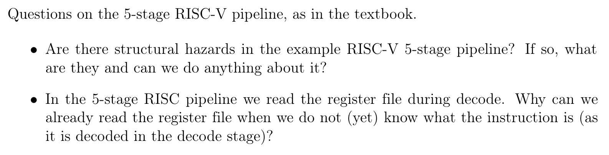

# Problem 1

(1)
No structural hazard will ouccrus since we have 2 memories in cour pipline if this was not the case a strctual hazard would accour when the fetch and mem would overlap

(2)

We can start decoding since the intrctions format is the same and therefore all fildes will be in the sam postion. 

block offset = 4 bit
index = 5 bit (8 - 4 + 1)
tag = 23 bit 

## (1)

the offset is 4 bit thus:

2^4 = 16 bytes per cache line.

## (2)

index = 5 bit

block count = 2^5 = 32

## (3)

For each block = Overhead is per block.

Overhead = 32 * (23 tag + 1 valid) = 768 bit
Total = 16 * 8 * 32 + overhead = 4864 bit

## (4)

## Problem 4

Answer:

## (1)

(1) - First nop is due to rule (3). 
(2) - Slli and sub can not be bundled since they have a write data dependency of a5, rule (6)
(3) - sub and sw have write data dependency of a5, rule (6)
(4) - Since it branch is assumed taken, rule (5), it will try bundling a branch instruction and a load instruction and the instruction after that is then just assumed flushed.

## (2)

step 4 and 5 maybe? 

maybe no stalls......

## (3)

ipc = 8/6

## (4) (1)

There is no dependencies so it could be moved there. 

## (5) (2)

one stall becurse of a4

## (6) (3)

ipc = 8/(4+1) 

